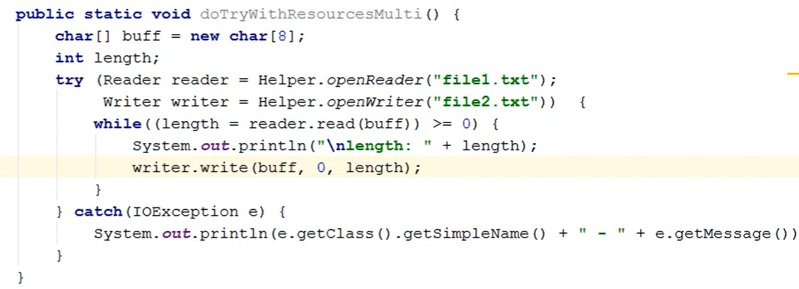

# java-fundamentals

What are streams?
Streams is an ordered sequence of data:
- Provides a common I/O model
- Abstract details of underlying source or destination (memory, disk-based storage, networking)
- Stream types are **unidirectional** (when you create an instance of a stream, you're either going to write to it or 
  to read from. No single stream does both)

Streams are broken into two categories
1. **Byte streams**: Interact as binary data
2. **Text streams**: Interact as Unicode characters

### Reading from a stream

The base class for reading from Binary data is **InputStream**
The base class for reading from Text data is **Reader**

To read an individual byte or a character we call the **read()** method

Reading one byte at a time:
```
InputStream input = // create IS
int valInt;
//if input.read() return -1 indicates end of stream
while((intVal=input.read())>=0) {
byte byteVal = (byte) intVal;
}
```

Reading one character at a time:
```
Reader reader = // create reader
int valInt;
//if reader.read() return -1 indicates end of stream
while((intVal=reader.read())>=0) {
char charVal = (char) intVal;
}
```

We can read all an array of bytes or character using **int read(byte[] buff)** or **int read(char[] buff)** method, these
reads also return an int, but in this case the int returned is the number of characters actually read 

Reading array of bytes:
```
InputStream input = // create IS
int length; // actual number of bytes read
byte[] byteBuff = new byte[10];
while( (length = input.read(byteBuff))>=0 ) {
 for(int i = 0; i<length; i++) {
   byte byteVal = byteBuff[i];
 }
 
}
```

Reading array of characters:
```
Reader reader = // create reader
int length; // actual number of bytes read
char[] charBuff = new char[10];
while( (length = reader.read(charBuff))>=0 ) {
 for(int i = 0; i<length; i++) {
   char charVal = charBuff[i];
 }
 
}
```

### Writing to a stream

The base class for writing binary data to a stream is **OutputStream** (2 methods : void write(int b) to write one byte and void write(byte[] buff))
The base class for writing Text data is **Writer** (2 methods : void write(int ch) to write one character and void write(char[] buff))

###### Writing bytes:
```
OutputStream os = // create os;
byte byteVal = 100;
os.write(byteVal);

byte[] byteBuff = {0, 63, 127};
output.write(byteBuff); 
```

###### Writing characters:
```
Writer writer = // create writer;
char charVal = 'a';
writer.write(charVal);

char[] charBuff = {'a', 'b', 'c'};
writer.write(charBuff); 

String strVal = "Hello world";
writer.write(strVal);
```

The `InputStreamReader` class inherit from the Reader, allows us to `create a reader over an input stream`
The `OutputStreamWriter` class inherit from the Writer, allows us to `create a reader over an output stream`

## Stream errors and cleanup

Streams are backed by physical storage, very often that storage exists outside the Java Runtime(files or network connection...)
we need to somehow provide some kind of reliable cleanup.For that stream classes implement the `closable interface` which means that 
they also implement the AutoCloseable interface which provide support for *try-with-resources*.

##### try-with-resources, what is that?

- Automates cleanup of 1 or more resources (resource is any type that implements AutoCloseable)
- Optionally includes catch block(s) [Handle any errors that occur inside the try block but it will also
 handle the errors that are thrown at call to close method]
  

### Chaining streams
- Streams are often chaining together.
- One stream instance leverages another(we do this to create high level functionality)
- Simplifies reusability
- **Chain using constructor**

A good example of chaining is `InputStreamReader` : provides reader behavior over an InputStream, it allows us to have data
that comes in a binary format and allows as to process it as character data


